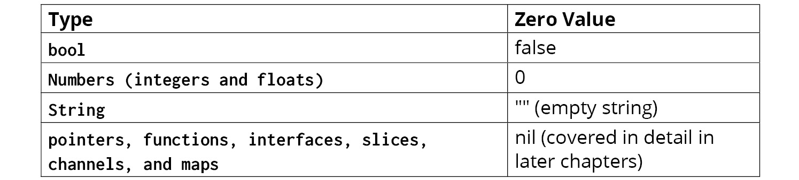

## Introduction

---

**Data**: is abstracted as `types` and `values`
  - `types`: can be viewed as value templates
  - `values`: can be viewed as type instances.
  
- `Types` can be names using `identifiers`

- **Identifiers**:
  - Can contain `unicode letters`, `unicode numbers` and `_`(underscore).
  - Can start with either an `Unicode letter` or `_`
  - [keywords](https://golang.org/ref/spec#Keywords) are special words cannot be used as identifiers.   
    ```bash
    break        default      func         interface    select
    case         defer        go           map          struct
    chan         else         goto         package      switch
    const        fallthrough  if           range        type
    continue     for          import       return       var
    ```
  - Just `_` as identifier is a blank identifier, meaning it can be used place where we're force to receive values which we don't want to use.
    - e.g.
      ```go
      func func1() (string, error)
      val, _ := func1()    // as we're forced to accept 2 return values and would like to bypass error value.
                           // so we can use `_` as a black identifier which just accepts the error value and ignores it.
                           // You can't use another identifier if you're not interested to use it as go doesn't allow unused variables
      ``` 
  -  An identifier starting with an `Upper case letter` is called an `exproted` or `public` identifier. 
  - and identifiers which don't start with `Upper case letter` are called `un-exported` or `private` identifier.
  
---

- **Built-in Basic Types**
  - Boolean type `bool`: `true` | `false`
  - Integer numeric types: `int8`, `uint8`, `int16`, `uint16`, `int32`, `uint32`, `int64`, `uint64`, `int`, `uint`, and `uintptr`
    ```bash
    uint8       the set of all unsigned  8-bit integers (0 to 255)
    uint16      the set of all unsigned 16-bit integers (0 to 65535)
    uint32      the set of all unsigned 32-bit integers (0 to 4294967295)
    uint64      the set of all unsigned 64-bit integers (0 to 18446744073709551615)
    
    int8        the set of all signed  8-bit integers (-128 to 127)
    int16       the set of all signed 16-bit integers (-32768 to 32767)
    int32       the set of all signed 32-bit integers (-2147483648 to 2147483647)
    int64       the set of all signed 64-bit integers (-9223372036854775808 to 9223372036854775807)
    
    float32     the set of all IEEE-754 32-bit floating-point numbers
    float64     the set of all IEEE-754 64-bit floating-point numbers
    
    complex64   the set of all complex numbers with float32 real and imaginary parts
    complex128  the set of all complex numbers with float64 real and imaginary parts
    
    byte        alias for uint8
    rune        alias for int32
    ```
    ```bash
    uint     either 32 or 64 bits
    int      same size as uint
    uintptr  an unsigned integer large enough to store the uninterpreted bits of a pointer value
    ```
    
    ```go
    package main
    
    import "fmt"
    
    func main() {
    	var i int
    	i = 2147483647
    	fmt.Println(i)
    
    	i = 9223372036854775807
    	fmt.Println(i)
    }
    ```
    ```bash
    2147483647
    9223372036854775807
    ```
    
    ```go
    package main
    
    import "fmt"
    
    func main() {
        var i int32
        i = 9223372036854775807
        fmt.Println(i)
    }
    ```
    
    ```bash
    constant 9223372036854775807 overflows int32
    ```
    - Even though `int` can hold either values from `int8` to `int64` but type of variable `int` and `intx` will not be treated as same.   
  - floating-point numeric types: `float32` and `float64`
  - complex numeric types: `complex64` and `complex128`
  - string type: `string`
  - Try `primitive_types.go`

---

- **Zero Value**      
  - Each type has a zero value.  
         
  - Try `zero_values.go`  


---
